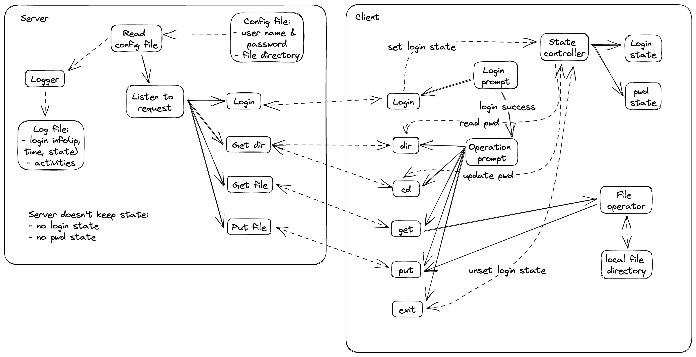

# File Sharing System

## Overview

### Server

Read `settings.json` file,
maintain the directory specified as "root" on server file system.

Use Spring Boot framework, provide following APIs
- `getDir` for cd and ls
- `getFile` for get
- `login` for login
- `putFile` for put

### Client

Read `settings.json` file, which specifies
server IP address, port, and a local directory
(stores files to be uploaded or downloaded files).

Use APIs provide by server to
- validate login username and password
- fetch directory info
- upload file
- download file

## Development

macOS 12.6.5
- java 17.0.2 2022-01-18 LTS
- Gradle 8.1.1 (build tool)
- whatever text editor / IDE

Ubuntu 22.04 LTS

### Run the project

macOS
- Install [HomeBrew](https://brew.sh/)
    `/bin/bash -c "$(curl -fsSL https://raw.githubusercontent.com/Homebrew/install/HEAD/install.sh)"`
- `brew update`
- Install java `brew install openjdk@17`
- Install Gradle `brew install gradle`
- run server
    - `cd ./fss_server`
    - `gradle bootRun`
- run client
    - `cd ./fss_client`
    - `gradle run --console=plain`

Ubuntu 22.04
- Install java `sudo apt install openjdk-17-jdk`
- Install Gradle [here](https://gradle.org/install/)
- run server
    - `cd ./fss_server`
    - `gradle bootRun`
- run client
    - `cd ./fss_client`
    - `gradle run --console=plain`

## Deatils

[javadoc](https://fss-doc.vercel.app/)

