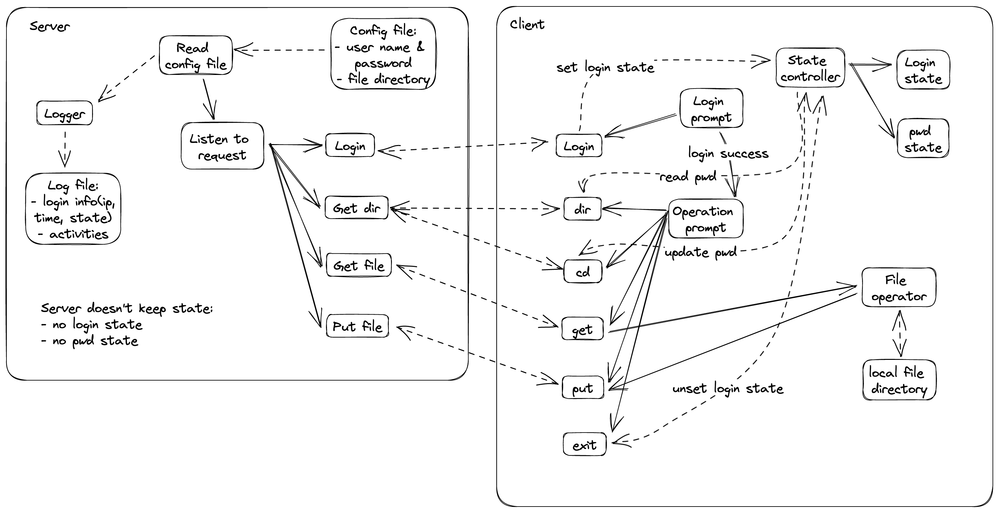

# 文件传输程序

## 概述



### 服务端

启动时读取`settings.json`，在服务端维护一个"root"目录。

```json
{
    "root": "/tmp/fss"
}
```

使用 Spring Boot 框架，提供如下 API
- `getDir` : cd and ls
- `getFile` : get
- `login` : login
- `putFile` : put

### 客户端

启动时读取`settings.json`，其中包含本地路径，服务器ip及端口

```json
{
    "root": "/Users/kjy/Desktop",
    "server": {
        "host": "10.128.185.202",
        "port": 8888
    }
}
```

使用后端 API 完成以下功能
- 登陆鉴权
- 获得远程文件目录信息
- 上传文件
- 下载文件

## 开发环境

macOS 12.6.5
- java 17.0.2 2022-01-18 LTS
- Gradle 8.1.1 (build tool)
- IntelliJ IDEA / Neovim

Ubuntu 22.04 LTS
- openjdk 17.0.6 2023-01-17
- Gradle 7.4.2
- IntelliJ IDEA / Neovim

### 运行方式

1. 下载java，Gradle
2. 运行 server
    - `cd ./fss_server/`
    - `./gradlew bootRun`
```
❯ ./gradlew bootRun
Path for java installation '/usr/lib/jvm/openjdk-17' (Common Linux Locations) does not contain a java executable

> Task :app:bootRun

  .   ____          _            __ _ _
 /\\ / ___'_ __ _ _(_)_ __  __ _ \ \ \ \
( ( )\___ | '_ | '_| | '_ \/ _` | \ \ \ \
 \\/  ___)| |_)| | | | | || (_| |  ) ) ) )
  '  |____| .__|_| |_|_| |_\__, | / / / /
 =========|_|==============|___/=/_/_/_/
 :: Spring Boot ::                (v3.0.0)

2023-05-12 21:45:46,468 INFO (StartupInfoLogger.java:51)- Starting App using Java 17.0.6 with PID 17718 (/home/kjy/Documents/file_sharing_system/fss_server/app/build/classes/java/main started by kjy in /home/kjy/Documents/file_sharing_system/fss_server/app)
2023-05-12 21:45:46,470 INFO (SpringApplication.java:630)- No active profile set, falling back to 1 default profile: "default"
2023-05-12 21:45:47,127 INFO (TomcatWebServer.java:114)- Tomcat initialized with port(s): 8888 (http)
2023-05-12 21:45:47,134 INFO (DirectJDKLog.java:173)- Initializing ProtocolHandler ["http-nio-8888"]
2023-05-12 21:45:47,135 INFO (DirectJDKLog.java:173)- Starting service [Tomcat]
2023-05-12 21:45:47,135 INFO (DirectJDKLog.java:173)- Starting Servlet engine: [Apache Tomcat/10.1.1]
2023-05-12 21:45:47,189 INFO (DirectJDKLog.java:173)- Initializing Spring embedded WebApplicationContext
2023-05-12 21:45:47,190 INFO (ServletWebServerApplicationContext.java:291)- Root WebApplicationContext: initialization completed in 684 ms
2023-05-12 21:45:47,245 INFO (Settings.java:29)- Root path does not exist, creating it
2023-05-12 21:45:47,245 INFO (Settings.java:35)- Load root path success: /tmp/fss
2023-05-12 21:45:47,454 INFO (DirectJDKLog.java:173)- Starting ProtocolHandler ["http-nio-8888"]
2023-05-12 21:45:47,466 INFO (TomcatWebServer.java:226)- Tomcat started on port(s): 8888 (http) with context path ''
2023-05-12 21:45:47,474 INFO (StartupInfoLogger.java:57)- Started App in 1.412 seconds (process running for 1.654)
```

3. 运行 client
    - `cd ./fss_client/`
    - `gradle run --console=plain`
```
❯ ./gradlew run --console=plain
======================
Root path does not exist, creating it
Settings loaded:
Root: /Users/kjy/Desktop/
Host: 10.128.185.201
Port: 8888
======================
Enter username: 
```

## 实现细节

> 类方法接口详见 [javadoc](https://fss-doc.vercel.app/)

### 客户端

- `App`
- `FileManager`  
    The FileManager class is responsible for handling all the request fetching file and other information from server.
    
- `Settings`  
    The Settings class is responsible for loading settings from settings.json file.
    
- `User`
    

### 服务端

- configurations (这些是 Spring 的 Bean)
    - `DataConfig`
    - `FileConfig`
- controllers
    - `GetDirController`  
    GetDirController provide feature of cd and ls command
    
    - `GetFileController`  
    GetFileController provide feature of get command
    
    - `LoginController`  
    LoginController provide feature for login validation
    
    - `PutFileController`  
    PutFileController provide feature of put command
    
- entities
    - `User`  
    
- file_access
    - `FileManager`  
    This class is responsible for all file operations.
    
    - `Settings`  
    This class is responsible for reading the settings file.
    
    - `UserData`  
    This class is responsible for reading and writing the users file.
    

